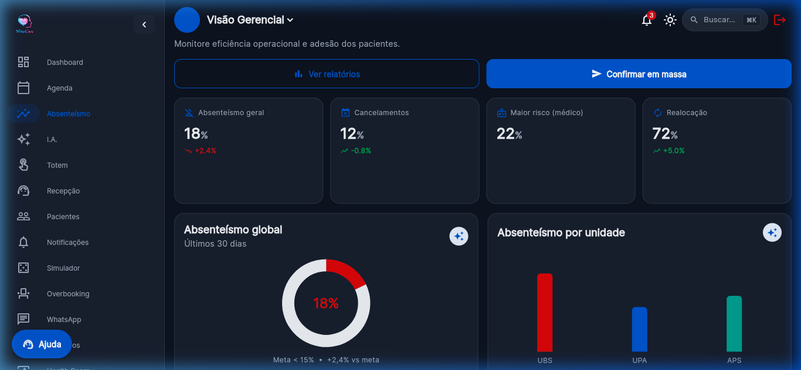
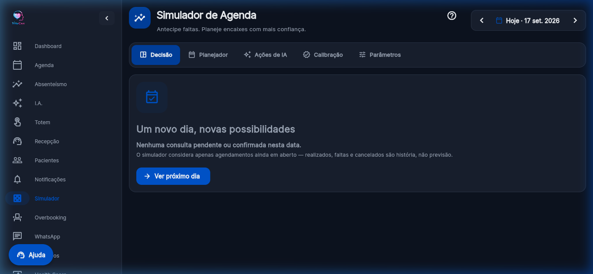
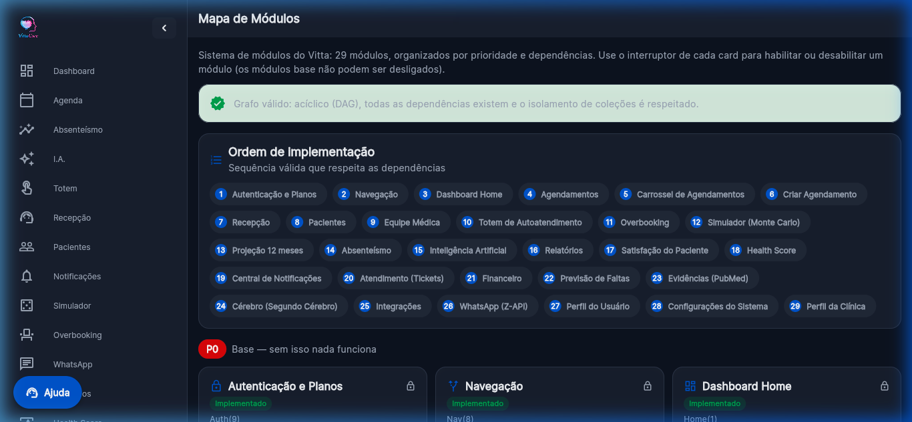

<div align="center">


# Vitta Care

### Plataforma de Modelagem Estocástica e Otimização de Capacidade Assistencial para Redução de Absenteísmo em Serviços de Saúde

[](#11-prontidão-tecnológica-e-programa-eldorado)
[](https://flutter.dev)
[](https://dart.dev)
[](https://firebase.google.com)
[](#10-conformidade-lgpd-e-propriedade-intelectual)
[](#11-prontidão-tecnológica-e-programa-eldorado)

<br/>

**VITTA CARE SOLUTIONS INOVA SIMPLES (I.S.)**

</div>

---

> **Propósito deste repositório.** Concentrar evidências técnicas do desenvolvimento da plataforma Vitta Care — código-fonte demonstrativo, capturas de tela operacionais, formulações matemáticas implementadas e documentação arquitetural — para comprovação de maturidade tecnológica no contexto do **Programa ELDORADO de Aceleração Tecnológica em IA para Startups**.

---

## Sumário

1. [Formulação do Problema](#1-formulação-do-problema)
2. [Abordagem Técnica](#2-abordagem-técnica)
3. [Simulador de Monte Carlo com Cópula Gaussiana](#3-simulador-de-monte-carlo-com-cópula-gaussiana)
4. [Cadeia de Markov da Jornada do Agendamento](#4-cadeia-de-markov-da-jornada-do-agendamento)
5. [Motor de Decisão de Overbooking](#5-motor-de-decisão-de-overbooking)
6. [Arquitetura Modular e Grafo Acíclico Dirigido](#6-arquitetura-modular-e-grafo-acíclico-dirigido)
7. [Evidências Visuais da Plataforma](#7-evidências-visuais-da-plataforma)
8. [Pipeline de Calibração e Integridade Estatística](#8-pipeline-de-calibração-e-integridade-estatística)
9. [Estrutura do Repositório](#9-estrutura-do-repositório)
10. [Conformidade LGPD e Propriedade Intelectual](#10-conformidade-lgpd-e-propriedade-intelectual)
11. [Prontidão Tecnológica e Programa ELDORADO](#11-prontidão-tecnológica-e-programa-eldorado)

---

## 1. Formulação do Problema

O **absenteísmo de pacientes** (no-show) em consultas ambulatoriais gera perda de capacidade assistencial cujo impacto cascateia sobre o sistema de saúde:

- **Ociosidade clínica irreversível.** O horário do profissional de saúde é perecível: uma vez transcorrido, não pode ser recuperado.
- **Amplificação de filas de espera.** Vagas não preenchidas aumentam o tempo médio de espera para todos os pacientes subsequentes na rede.
- **Assimetria entre cancelamento e falta.** Um cancelamento com antecedência suficiente libera a vaga para reocupação; uma falta sem aviso não libera nada — a cadeira fica vazia e a capacidade é destruída. Soluções que tratam os dois desfechos como equivalentes superestimam sistematicamente a capacidade recuperável.

As abordagens convencionais operam de forma **reativa** (lembretes não segmentados, cancelamentos tardios) e **homogênea** (mesma intervenção para todo paciente). A Vitta Care substitui essas premissas por **estimação probabilística individualizada**, **dependência entre desfechos do mesmo dia** e **decisão de overbooking por slot** (médico × hora), não por dia.

---

## 2. Abordagem Técnica

A solução implementa três camadas matemáticas que se alimentam mutuamente:

```text
                    ┌────────────────────────────────────┐
                    │  Probabilidades individuais p_i    │
                    │  (risco categórico → calibração)   │
                    └──────────┬─────────────────────────┘
                               │
              ┌────────────────▼────────────────────┐
              │  Monte Carlo com Cópula Gaussiana    │
              │  (20.000 runs, ρ = 0.03, 3 estados) │
              └──────────┬─────────────────┬────────┘
                         │                 │
              ┌──────────▼──────┐  ┌───────▼──────────────┐
              │  Poisson-Binomial│  │  Projeção 12 meses   │
              │  exata (ρ = 0)  │  │  Markov + Monte Carlo │
              └──────────┬──────┘  └───────┬──────────────┘
                         │                 │
              ┌──────────▼─────────────────▼──────────────┐
              │  Decisão de Overbooking por Slot           │
              │  (alocação gulosa, risco por pior slot)    │
              └───────────────────────────────────────────┘
```

A distinção entre os três desfechos (comparece, cancela com antecedência, falta sem avisar) é estrutural, não simplificação: cada um tem consequência operacional distinta e probabilidade marginal independente por consulta.

---

## 3. Simulador de Monte Carlo com Cópula Gaussiana

O motor de simulação está implementado em [`monte_carlo_engine.dart`](https://github.com/allanfs1/Vitta_Care_flutter/blob/main/lib/features/monte_carlo/monte_carlo_engine.dart) (~776 linhas de Dart, lógica pura testável sem Flutter).

### 3.1 Modelagem da Dependência

Faltas do mesmo dia **não são independentes**. Fatores sistêmicos — chuva forte, greve de transporte, ondas respiratórias, feriado — movem todos os desfechos na mesma direção. Uma Poisson-Binomial pura subestima a variância da contagem de faltas. A solução é uma **cópula gaussiana de um fator**:

$$X_i = \sqrt{\rho}\, Z + \sqrt{1 - \rho}\, \varepsilon_i, \qquad Z, \varepsilon_i \sim \mathcal{N}(0,1)$$

onde $Z$ é o **fator sistêmico do dia** (compartilhado por todos os agendamentos) e $\varepsilon_i$ é o componente idiossincrático de cada consulta. O parâmetro $\rho \in [0, 1)$ calibra a intensidade da correlação latente. Valores observados típicos estão entre $0{,}02$ e $0{,}05$; o padrão é $\rho = 0{,}03$.

O desfecho é determinado por limiares na escala latente:

$$\text{desfecho}_i = \begin{cases}
\texttt{falta}       & \text{se } X_i \le \Phi^{-1}(p_i^{\text{falta}}) \\
\texttt{cancelamento} & \text{se } X_i \le \Phi^{-1}(p_i^{\text{falta}} + p_i^{\text{cancel}}) \\
\texttt{comparecimento} & \text{caso contrário}
\end{cases}$$

Esta formulação preserva **exatamente** as probabilidades marginais de cada consulta enquanto injeta a correlação desejada entre elas.

### 3.2 Caso Degenerado: Poisson-Binomial Exata

Quando $\rho = 0$ a simulação é substituída pela **forma fechada da Poisson-Binomial** por convolução dinâmica $O(n^2)$, eliminando qualquer erro de amostragem. Este caminho serve como **oráculo** para os testes do amostrador.

```dart
/// PMF exata da Poisson-binomial por convolução dinâmica.
/// Exata e O(n²) — para n = 220 são ~48 mil operações, microssegundos.
static List<double> poissonBinomialPmf(List<double> ps) {
  var pmf = <double>[1.0];
  for (final p in ps) {
    final pc = p.clamp(0.0, 1.0);
    final next = List<double>.filled(pmf.length + 1, 0.0);
    for (var k = 0; k < pmf.length; k++) {
      final v = pmf[k];
      if (v == 0) continue;
      next[k] += v * (1 - pc);
      next[k + 1] += v * pc;
    }
    pmf = next;
  }
  return pmf;
}
```

### 3.3 Intervenção via Razão de Chances

Reduções de risco são modeladas como **razão de chances** (odds ratio), não como delta aditivo sobre probabilidade. Um delta aditivo $(p - \delta)$ produz probabilidades negativas quando $p < \delta$; o odds ratio mantém o resultado em $(0, 1)$ para qualquer entrada:

$$p_{\text{pós}} = \frac{p \cdot \omega}{1 - p + p \cdot \omega}, \qquad \omega < 1 \Rightarrow \text{redução}$$

### 3.4 Dispersion Index

Ao final da simulação, o motor calcula o fator de dispersão observado $\phi = \text{Var}[\text{faltas}]_{\text{simulada}} \,/\, \text{Var}[\text{faltas}]_{\text{independente}}$ como diagnóstico empírico da sobredispersão introduzida pela cópula.

---

## 4. Cadeia de Markov da Jornada do Agendamento

O ciclo de vida de uma consulta é modelado como cadeia de Markov absorvente com 7 estados, implementada em [`markov_engine.dart`](https://github.com/allanfs1/Vitta_Care_flutter/blob/main/lib/features/projecao_12m/markov_engine.dart):

$$\mathcal{S} = \underbrace{\{\texttt{agendado},\, \texttt{aguardando\_confirmacao},\, \texttt{confirmado}\}}_{\text{transitórios}} \cup \underbrace{\{\texttt{compareceu},\, \texttt{faltou},\, \texttt{cancelado},\, \texttt{reagendado}\}}_{\text{absorventes}}$$

> **Reagendado é estado próprio**, não cancelamento. Reagendar preserva o paciente no sistema **e** devolve a vaga; cancelar perde as duas coisas. Colapsar os dois superestima a perda e apaga exatamente o desfecho que a intervenção mais tenta produzir.

### 4.1 Estimação com Suavização de Dirichlet

A pseudo-contagem $\alpha$ não é enfeite: sem ela, um estado nunca observado produz uma linha inteira de zeros — que não é distribuição de probabilidade e quebra a simulação em silêncio.

```dart
static MatrizTransicao estimar(List<EventoTransicao> eventos, {double alpha = 1.0}) {
  final contagens = <EstadoAgendamento, Map<EstadoAgendamento, double>>{
    for (final o in EstadoAgendamento.values)
      o: {for (final d in EstadoAgendamento.values) d: alpha},
  };
  for (final e in eventos) {
    if (e.origem.absorvente) continue;
    contagens[e.origem]![e.destino] = (contagens[e.origem]![e.destino] ?? 0) + 1;
  }
  // Normalização: soma de cada linha = 1.0 (absorventes = auto-laço puro)
}
```

### 4.2 Cadeia Não-Homogênea por Faixa Temporal

Uma cadeia homogênea afirma que a chance de confirmar é a mesma faltando 30 dias ou faltando 1. Isso é empiricamente falso. A implementação particiona os eventos em **faixas de dias até a consulta** (`30–15`, `14–8`, `7–4`, `3–2`, `1–0`) e estima matrizes independentes por faixa.

### 4.3 Shrinkage Hierárquico (Empirical Bayes)

Segmentos com poucas observações são "encolhidos" em direção à matriz global, evitando overfitting em amostras pequenas e resolvendo o problema de **partida a frio** (cold-start):

$$\hat{P}_{\text{seg}} = w \cdot P_{\text{seg}} + (1 - w) \cdot P_{\text{global}}, \qquad w = \frac{n_{\text{seg}}}{n_{\text{seg}} + k}$$

onde $k = 50$ é o número de observações que dá peso 50/50. Abaixo disso, a matriz global domina; acima, o segmento fala por si.

---

## 5. Motor de Decisão de Overbooking

O overbooking não é decidido por dia, mas por **slot** (médico × hora), pois uma falta às 16h não libera capacidade para um encaixe às 9h.

### 5.1 Alocação Gulosa

Cada encaixe é alocado no slot que **adiciona o menor risco marginal**. O cenário é julgado pelo **pior slot** — não pela média — para evitar que um slot seguro mascare um slot já saturado.

### 5.2 Dois Modos de Risco

| Modo | Encaixe falta? | Interpretação |
|:---|:---|:---|
| **Conservador** (`EncaixeModo.certo`) | Não | Limite superior do risco. |
| **Probabilístico** (`EncaixeModo.probabilistico`) | Sim, com $p_{\text{encaixe}}$ | Convolução da distribuição do slot com a Binomial dos encaixes. Ignora o fator comum do dia para encaixes — portanto é levemente **otimista**. |

Os dois modos fornecem **limites** inferior e superior do risco, não uma estimativa pontual única.

### 5.3 Fila antes do Overbooking

A **lista de espera** é dimensionada pelo quartil inferior ($Q_{25}$) das vagas liberadas por cancelamento — não pela média, que erraria para cima em metade dos dias. Preencher uma vaga de fato liberada não cria espera para ninguém; o encaixe especulativo cria.

---

## 6. Arquitetura Modular e Grafo Acíclico Dirigido

### 6.1 Registro de Módulos

A plataforma é composta por **28 módulos** registrados declarativamente em [`module_registry.dart`](https://github.com/allanfs1/Vitta_Care_flutter/blob/main/lib/core/modules/module_registry.dart). Cada módulo declara:

| Atributo | Semântica |
|:---|:---|
| `id` | Identificador estável (corresponde à pasta em `features/`) |
| `priority` | Faixa de prioridade: P0 (base), P1 (fluxo diário), P2 (analytics), P3 (avançado) |
| `status` | Estado real: `implemented`, `partial` ou `planned` |
| `dependsOn` | Lista de ids dos módulos dos quais este depende (arestas do grafo) |
| `ownedCollections` | Coleções Firestore onde o módulo **pode escrever** |
| `readsCollections` | Coleções compartilhadas que o módulo **apenas lê** |

### 6.2 Invariantes do Grafo

O grafo de dependências é validado em runtime pelo [`ModuleGraph`](https://github.com/allanfs1/Vitta_Care_flutter/blob/main/lib/core/modules/module_graph.dart), que garante três invariantes simultaneamente:

**1. Aciclicidade (DAG).** Detecção de ciclos por DFS com coloração de três estados (branco/cinza/preto). Se um ciclo existir, a ordenação topológica lança `StateError` e a validação retorna os ciclos detectados.

**2. Completude de dependências.** Toda aresta aponta para um módulo que existe no registro. Referências a módulos inexistentes são coletadas como `missingDeps`.

**3. Isolamento de coleções.** Cada coleção Firestore `owned` pertence a **no máximo um módulo**. Se dois módulos declaram escrita na mesma coleção, `collectionConflicts` registra a violação.

```dart
/// Detecção de ciclos via DFS com coloração tripartite.
List<List<String>> detectCycles() {
  final cycles = <List<String>>[];
  final state = <String, int>{}; // 0=branco, 1=cinza, 2=preto
  final stack = <String>[];
  void dfs(String id) {
    state[id] = 1;
    stack.add(id);
    for (final dep in _byId[id]?.dependsOn ?? const []) {
      if (_byId[dep] == null) continue;
      if (state[dep] == 1) {
        final start = stack.indexOf(dep);
        cycles.add([...stack.sublist(start), dep]);
      } else if (state[dep] != 2) {
        dfs(dep);
      }
    }
    stack.removeLast();
    state[id] = 2;
  }
  for (final m in modules) {
    if (state[m.id] != 2) dfs(m.id);
  }
  return cycles;
}
```

### 6.3 Ordenação Topológica e Hot-Swap

A **ordenação topológica** fornece uma sequência de implementação que respeita todas as dependências. Na interface, cada módulo pode ser habilitado ou desabilitado em tempo de execução; o grafo garante que desabilitar um módulo bloqueia automaticamente as rotas dos módulos que dele dependem (via `transitiveDependencies`), sem quebrar o restante do sistema.

### 6.4 Hierarquia de Prioridades

```text
P0 (Base)         auth → navegacao → home → agendamentos → criar_agendamento
P1 (Fluxo diário) recepcao, pacientes, equipe_medica, totem
P2 (Analytics)    absenteismo, monte_carlo, overbooking, health_score, relatorios
P3 (Avançado)     projecao_12m, ia, whatsapp, evidencias, cerebro
```

---

## 7. Evidências Visuais da Plataforma

As capturas abaixo foram extraídas da aplicação em execução, demonstrando o funcionamento real dos módulos de absenteísmo e gestão operacional.

### 7.1 Painel de Indicadores Operacionais
> Dashboard central com KPIs de absenteísmo, taxa de ocupação e evolução temporal.

<div align="center">
  
</div>

---

### 7.2 Motor de Predição de Absenteísmo
> Módulo preditivo com estratificação de risco por paciente, heatmap de concentração de faltas por dia/horário, índice de absenteísmo segmentado por médico e especialidade.

<div align="center">
  
</div>

---

### 7.3 Simulador Estocástico de Monte Carlo
> Interface de parametrização da simulação: número de runs, correlação latente (ρ), modo de encaixe, distribuição de faltas por slot (médico × hora) e avaliação de cenários de overbooking.

<div align="center">
  
</div>

---

### 7.4 Projeção em 12 Meses (Cadeia de Markov + Monte Carlo)
> Projeção operacional e financeira: cenário baseline versus cenário com intervenção, decomposição de receita defensável versus antecipação de demanda, governança de parâmetros.

<div align="center">
  
</div>

---

### 7.5 Gestão de Agendamentos e Grade Médica
> Grade de agendamentos com alertas de risco preditivo integrados.

<div align="center">
  
</div>

---

### 7.6 Mapa de Módulos e Validação do Grafo de Dependências (DAG)
> Sistema de governança arquitetural com 28 módulos, ordenação topológica e status de implementação.

<div align="center">
  
</div>

---

## 8. Pipeline de Calibração e Integridade Estatística

Antes de substituir os parâmetros padrão do modelo pelas taxas observadas na base real de uma clínica, o motor de calibração ([`monte_carlo_calibracao.dart`](https://github.com/allanfs1/Vitta_Care_flutter/blob/main/lib/features/monte_carlo/monte_carlo_calibracao.dart)) executa verificações de integridade dos dados:

| Verificação | Tipo | Consequência |
|:---|:---|:---|
| Amostra mínima por faixa de risco | Bloqueante se $n < 50$ | Taxa não substitui o padrão (Wilson CI muito largo) |
| Drift temporal (taxa dos últimos 30d vs histórica) | Alerta | Sinaliza necessidade de recalibração |
| Label version mismatch | Bloqueante | Impede comparação de séries com rótulos de desfecho diferentes |

O intervalo de confiança utilizado é o de **Wilson**, não Wald: com poucas observações ou taxa próxima de 0 ou 1, o Wald produz limites fora de $[0, 1]$.

---

## 9. Estrutura do Repositório

```text
vitta-care-trl-evidencias/
├── README.md                          # Este documento
├── CHANGELOG.md                       # Histórico de evolução tecnológica
│
├── docs/
│   ├── arquitetura.md                 # Componentes, camadas e integrações
│   ├── modelo-preditivo.md            # Formulação MC, Markov e calibração
│   ├── pipeline-dados.md              # ETL, feature engineering e PHI Guard
│   ├── integracoes.md                 # Matriz de integrações homologadas
│   ├── testes-validacao.md            # Protocolos e resultados de validação
│   └── evolucao-tecnologica.md        # Diagnóstico de TRL e metas ELDORADO
│
├── evidencias/
│   ├── dashboards/                    # Home, projeção 12m, monitor, health score
│   ├── modelo-ia/                     # Absenteísmo, simulador Monte Carlo
│   └── screenshots/                   # Login, agenda, recepção, módulos
│
├── exemplos/
│   ├── exemplo_dados_anonimizados.csv # Dataset sintético demonstrativo
│   ├── exemplo_inferencia.json        # Payload de entrada para predição
│   └── exemplo_resultado.json         # Resposta do motor preditivo
│
└── diagrams/                          # Logo, fluxos e diagramas conceituais
```

---

## 10. Conformidade LGPD e Propriedade Intelectual

Este repositório é **exclusivamente documental e demonstrativo**. Não contém bases de dados de produção, identificadores de pacientes, credenciais de infraestrutura ou código proprietário estratégico.

Todos os exemplos JSON/CSV são **sintéticos**, elaborados para verificação metodológica. A plataforma aplica os princípios de *Privacy by Design* com o módulo **PHI Guard**, que remove determinísticamente identificadores pessoais antes de qualquer processamento analítico.

---

## 11. Prontidão Tecnológica e Programa ELDORADO

A solução situa-se no nível **TRL 5/6** — tecnologia demonstrada e validada em ambiente computacional representativo.

### Desafios Tecnológicos Propostos para Aceleração (TRL 7 → 9)

| Desafio | Complexidade Científica |
|:---|:---|
| **MLOps contínuo e drift detection** | Pipeline autônomo de monitoramento de data drift e concept drift com recalibração adaptativa |
| **Explicabilidade clínica (XAI)** | SHAP TreeExplainer com vocabulário compreensível ao corpo clínico, limites éticos para não-discriminação |
| **Interoperabilidade HL7 FHIR / e-SUS / RNDS** | Adaptadores padronizados para integração com a Rede Nacional de Dados em Saúde |
| **Validação em ambiente operacional** | Piloto controlado com mensuração do poder estatístico necessário para detectar efeito mínimo clinicamente relevante |

---

<div align="center">
  <sub>© 2026 Vitta Care Solutions · Todos os direitos reservados</sub>
</div>
