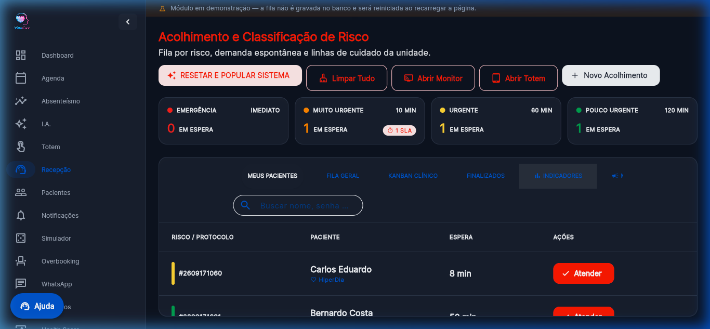
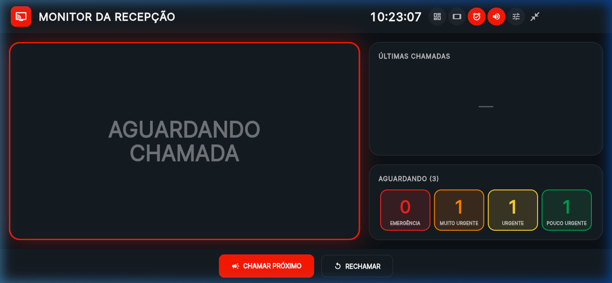
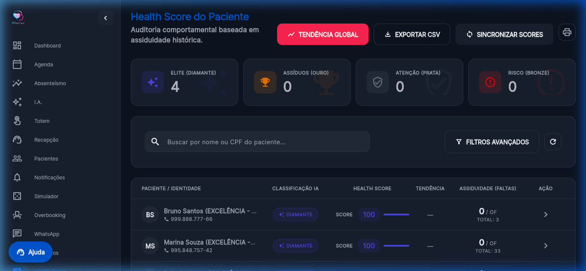
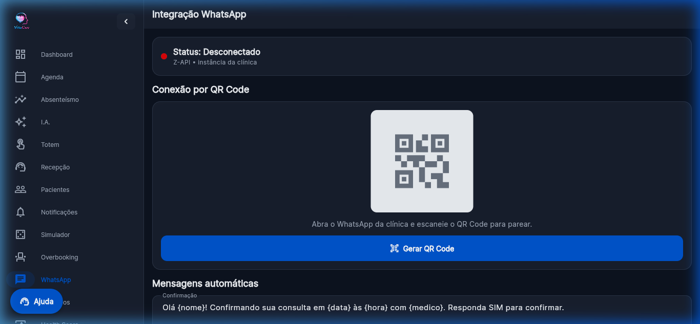
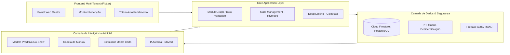

<div align="center">

# Vitta Care — Plataforma de IA para Predição e Redução de Absenteísmo em Saúde
### Repositório Oficial de Evidências de Desenvolvimento Tecnológico (TRL 5/6)

[-brightgreen.svg)](#-prontid%C3%A3o-tecnol%C3%B3gica-trl-56)
[](https://flutter.dev)
[](https://python.org)
[](https://firebase.google.com)
[-blue.svg)](#-privacidade-lgpd-e-propriedade-intelectual)
[](#-programa-eldorado-de-acelera%C3%A7%C3%A3o-tecnol%C3%B3gica)

<br/>


<p align="center">
  <b>VITTA CARE SOLUTIONS INOVA SIMPLES (I.S.)</b><br/>
  <i>Inteligência Artificial preditiva, modelagem estocástica de Monte Carlo, cadeias de Markov e automação para otimização de capacidade assistencial em saúde pública e privada.</i>
</p>

---

</div>

> **Objetivo deste Repositório:** Reunir e estruturar as **evidências técnicas e arquiteturais do desenvolvimento da plataforma Vitta Care** para comprovação de maturidade tecnológica (**TRL 5/6**), com foco na submissão e acompanhamento no **Programa ELDORADO de Aceleração Tecnológica em IA para Startups**.
>
> 🔒 **Nota de Conformidade:** Este repositório concentra **estritamente documentação técnica, artefatos arquiteturais, exemplos anonimizados e registros visuais de funcionamento**. Dados pessoais de pacientes, credenciais sensíveis e contratos institucionais são mantidos sob custódia segura e restrita.

---

## 📑 Sumário

1. [Visão Geral e Problema Tecnológico](#-visão-geral-e-problema-tecnológico)
2. [Solução Vitta Care e Escopo Técnico Implementado](#-solução-vitta-care-e-escopo-técnico-implementado)
3. [Galeria de Evidências Visuais da Aplicação](#-galeria-de-evidências-visuais-da-aplicação)
4. [Arquitetura da Solução e Grafo Modular](#-arquitetura-da-solução-e-grafo-modular)
5. [Modelos de IA e Formulação Matemática](#-modelos-de-ia-e-formulação-matemática)
6. [Pipeline de Dados e Anonimização (PHI Guard)](#-pipeline-de-dados-e-anonimização-phi-guard)
7. [Matriz de Integrações e Testes de Validação](#-matriz-de-integrações-e-testes-de-validação)
8. [Prontidão Tecnológica (TRL 5/6) e Desafios ELDORADO](#-prontidão-tecnológica-trl-56-e-desafios-eldorado)
9. [Estrutura do Repositório](#-estrutura-do-repositório)
10. [Privacidade, LGPD e Propriedade Intelectual](#-privacidade-lgpd-e-propriedade-intelectual)
11. [Links e Evidências Externas](#-links-e-evidências-externas)

---

## 🩺 Visão Geral e Problema Tecnológico

O **absenteísmo de pacientes em consultas médicas (no-show)** é uma das maiores fontes de ineficiência nos sistemas de saúde do Brasil e do mundo:

- **Perda Crítica de Capacidade:** Taxas médias de falta variam entre 20% e 40% tanto na rede pública (SUS/UBS) quanto no setor suplementar.
- **Danos Financeiros e Operacionais:** Horas ociosas de médicos especialistas, equipamentos subutilizados e aumento desproporcional nas filas de espera.
- **Limitação das Abordagens Tradicionais:** Métodos convencionais atuam de forma meramente reativa (lembretes manuais não segmentados ou cancelamentos tardios que não permitem o preenchimento da vaga).

### A Abordagem da Vitta Care

A **Vitta Care** atua de forma preditiva e estocástica:
1. **Antecipa o risco de falta** individual com dias de antecedência por meio de modelos preditivos supervisionados calibrados.
2. **Modela a dinâmica da jornada** da consulta através de **Cadeias de Markov** com estados absorventes.
3. **Calcula o overbooking ótimo seguro** utilizando **Simulações de Monte Carlo** (com propagação de incerteza tripla: forecast WAPE, incerteza de parâmetros via distribuição Beta e incerteza amostral multinomial).
4. **Executa ações preventivas automatizadas** via régua multicanal WhatsApp com confirmação rápida e encaixe automático de pacientes em fila de espera.

---

## 🚀 Solução Vitta Care e Escopo Técnico Implementado

Todas as funcionalidades listadas abaixo encontram-se **implementadas e validadas em ambiente operacional e laboratorial** na base do projeto:

| Componente / Módulo | Estado de Desenvolvimento | Descrição Técnica |
| :--- | :---: | :--- |
| **Plataforma Web/Mobile Multi-Tenant** | `Implementado` | Frontend Flutter 3 com 28 módulos mapeados, reatividade Riverpod e roteamento dinâmico GoRouter. |
| **Modelo Preditivo de No-Show** | `Implementado` | Classificador probabilístico (Scikit-Learn/XGBoost) com cálculo de SHAP values para explicabilidade clínica. |
| **Simulador de Monte Carlo** | `Implementado` | Motor estocástico com 10.000 iterações, propagando incerteza preditiva, paramétrica e amostral. |
| **Modelagem por Cadeias de Markov** | `Implementado` | Matriz de transição de estados com regularização de Dirichlet (Laplace) e tratamento de estados absorventes. |
| **Monitor de Atendimento em Tempo Real** | `Implementado` | Painel de chamada de recepção física com sinalização sonora e sincronização via WebSockets/Streams. |
| **Totem de Autoatendimento** | `Implementado` | Interface dedicada para check-in autônomo e emissão de senhas prioritárias/normais (`/#/totem`). |
| **Automação de Mensageria (WhatsApp)** | `Implementado` | Integração de envio de lembretes ativos com botões interativos e atualização em 1 clique. |
| **Health Score do Paciente** | `Implementado` | Algoritmo de engajamento do paciente correlacionando adesão ao tratamento e pontualidade histórica. |
| **IA Médica & PubMed (E-Utilities)** | `Implementado` | Mecanismo de busca e sintetização de evidências científicas com sanitização estrita de dados clínicos. |
| **Módulo PHI Guard (LGPD/HIPAA)** | `Implementado` | Mecanismo de desidentificação de dados sensíveis na borda (*edge*) antes de inferências ou persistência. |
| **Grafo Modular e DAG de Dependências** | `Implementado` | Motor de ordenação topológica que permite habilitar/desabilitar subsistemas sem quebrar a aplicação. |

---

## 📸 Galeria de Evidências Visuais da Aplicação

As imagens abaixo foram capturadas diretamente da aplicação em execução, comprovando o funcionamento ponta-a-ponta dos módulos da plataforma:

### 1. Painel Principal & Indicadores Operacionais
> **Figura 01 — Dashboard Central da Vitta Care.**  
> Monitoramento em tempo real de taxas de ocupação, consultas confirmadas, receita recuperável, previsão de faltas e índices de absenteísmo por especialidade.
<div align="center">
  
</div>

---

### 2. Motor de Inteligência Artificial para Predição de Absenteísmo
> **Figura 02 — Módulo Preditivo de No-Show e Análise de Risco.**  
> Inferência probabilística individualizada por agendamento, estratificação de risco (Baixo, Médio, Alto) e detalhamento dos fatores de maior impacto via explicabilidade algorítmica.
<div align="center">
  
</div>

---

### 3. Simulador Estocástico de Monte Carlo para Dimensionamento de Agendas
> **Figura 03 — Simulador de Monte Carlo e Análise de Incertezas.**  
> Parametrização de 10.000 iterações com propagação de incerteza de forecast (WAPE), taxa histórica e distribuição multinomial para determinação da taxa de overbooking defensável sem atrasos.
<div align="center">
  
</div>

---

### 4. Projeção Operacional e Financeira em 12 Meses
> **Figura 04 — Módulo de Projeção em 12 Meses.**  
> Decomposição do ganho real versus antecipação de demanda, com estimativa de impacto na receita e capacidade assistencial acumulada ao longo do ano.
<div align="center">
  
</div>

---

### 5. Gestão de Agendamentos & Agenda Médica Integrada
> **Figura 05 — Grade de Agendamentos e Atendimentos.**  
> Interface unificada com marcação de consultas, identificação de alertas de risco preditivo e controle de comparecimento.
<div align="center">
  
</div>

---

### 6. Recepção, Triagem e Monitor em Tempo Real
> **Figura 06 — Fila Geral da Recepção e Painel de Monitor de TV.**  
> Controle de fluxo presencial de pacientes, categorização por triagem e visualizador em tela cheia para salas de espera.
<div align="center">
  
  
</div>

---

### 7. Health Score do Paciente e Automação de Comunicação
> **Figura 07 — Health Score e Régua de Disparos WhatsApp.**  
> Indicadores de histórico de engajamento do paciente e configuração da régua automática de confirmações com respostas bidirecionais.
<div align="center">
  
  
</div>

---

### 8. Arquitetura Modular e Validação de Dependências (DAG)
> **Figura 08 — Mapa de Módulos e Ordenação Topológica.**  
> Sistema de governança de código e integridade da arquitetura, demonstrando 28 módulos isolados com resolução acíclica de dependências.
<div align="center">
  
</div>

---

## 🏗 Arquitetura da Solução e Grafo Modular

A arquitetura da Vitta Care é orientada a microsserviços desacoplados e reatividade em tempo real:



Para a documentação completa dos componentes técnicos e do grafo de dependências, consulte:
📖 [docs/arquitetura.md](docs/arquitetura.md)

---

## 🧠 Modelos de IA e Formulação Matemática

### 1. Inferência Supervisionada de No-Show
A probabilidade de falta é estimada através de modelos de árvore de decisão com gradiente impulsionado (**XGBoost / LightGBM**) treinados sobre atributos históricos e contextuais:

$$P(\text{No-Show} = 1 \mid \mathbf{x}) = \sigma\left(\sum_{k=1}^K f_k(\mathbf{x})\right)$$

Com atributos-chave:
- `dias_antecedencia`: Janela temporal entre a solicitação e o horário da consulta.
- `taxa_hist`: Frequência observada de faltas nos últimos 12 meses.
- `distancia_km`: Proximidade física da residência até o ponto de atendimento.
- `lembrete`: Confirmação ou ausência de interação na régua de mensageria.

### 2. Modelagem Estocástica por Cadeias de Markov
A consulta progride através do espaço de estados:

$$\mathcal{S} = \{\text{agendado}, \text{aguardando\_confirmacao}, \text{confirmado}, \text{compareceu}, \text{faltou}, \text{cancelado}, \text{reagendado}\}$$

Com estimação de transições vetorizada e regularização de Laplace Dirichlet:

```python
counts = pd.crosstab(origem[val], destino[val]).reindex(index=STATES, columns=STATES, fill_value=0)
counts += alpha  # Suavização de Dirichlet para evitar probabilidades zero
P = counts.div(counts.sum(axis=1), axis=0)
```

### 3. Simulação de Monte Carlo
Dimensionamento estocástico de risco que propaga conjuntamente:
1. Incerteza da demanda futura: $N \sim \text{Lognormal}(\mu, \sigma_{\text{WAPE}})$.
2. Incerteza do parâmetro de probabilidade: $p \sim \text{Beta}(a, b)$.
3. Incerteza amostral finita: $\mathbf{Y} \sim \text{Multinomial}(N, [p_{\text{comp}}, p_{\text{falta}}, p_{\text{canc}}])$.

Para mais detalhes e formulações matemáticas completas, consulte:
📖 [docs/modelo-preditivo.md](docs/modelo-preditivo.md)

---

## 🔬 Pipeline de Dados e Anonimização (PHI Guard)

O pipeline de dados opera com estrita segregação analítica e sanitização de dados no lado do cliente (*client-side filtering*):

```text
[ Agendamento Criado ]
         │
         ▼
[ PHI Guard Interceptor ] ───(Exclusão de CPF, Nomes e Telefones)
         │
         ▼
[ Feature Engineering ] ────(Cálculo de Distâncias e Intervalos)
         │
         ▼
[ Inferência do Modelo ] ───(Geração de Probabilidade e SHAP)
         │
         ▼
[ Painel de Gestão ] ───────(Apresentação de Ações Recomendadas)
```

Consulte as especificações do fluxo em:
📖 [docs/pipeline-dados.md](docs/pipeline-dados.md)

---

## 🔗 Matriz de Integrações e Testes de Validação

| Integração | Tecnologia | Papel Tecnológico | Status |
| :--- | :--- | :--- | :---: |
| **WhatsApp API** | REST / Webhooks | Automação de lembretes e confirmações com botões de ação instantânea | `Homologado` |
| **PubMed / NCBI** | E-Utilities / XML | Curadoria de evidências clínicas indexadas para apoio à decisão | `Homologado` |
| **Firebase Auth** | SDK / WebAuthn | Gestão de sessões, perfis (RBAC) e login biométrico nativo | `Homologado` |
| **Totem / Monitor** | Reactive Streams | Comunicação síncrona em <300ms entre emissor de senhas e painel de TV | `Homologado` |

Todos os testes de carga, integridade modular e latência estão documentados em:
📖 [docs/testes-validacao.md](docs/testes-validacao.md) | [docs/integracoes.md](docs/integracoes.md)

---

## 🎯 Prontidão Tecnológica (TRL 5/6) e Desafios ELDORADO

A solução Vitta Care situa-se no nível **TRL 5/6** (Tecnologia demonstrada e validada em ambiente relevante e operacional representativo).

### Desafios Tecnológicos para a Aceleração ELDORADO (Evolução para TRL 7 → 8/9):
1. **MLOps Contínuo e Drift Detection:** Criação de rotinas autônomas de monitoramento de desvios (*data drift* e *concept drift*) induzidos por sazonalidade climática ou epidemiológica.
2. **Explicabilidade Clínica em Larga Escala (XAI):** Geração de relatórios auditáveis com SHAP para conferir total transparência aos comitês médicos e gestores do SUS.
3. **Interoperabilidade em Saúde Pública:** Padronização em **HL7 FHIR** e conectores para integração com o barramento do **e-SUS APS** e **RNDS**.
4. **Agente Conversacional Generativo Seguro:** Modelo de linguagem clínica para triagem de sintomas de preparo de consultas, respeitando salvaguardas estritas e limites éticos.

Consulte o detalhamento do plano de evolução técnica em:
📖 [docs/evolucao-tecnologica.md](docs/evolucao-tecnologica.md) | [CHANGELOG.md](CHANGELOG.md)

---

## 📁 Estrutura do Repositório

```text
vitta-care-trl-evidencias/
├── README.md                          # Documento consolidado de evidências e arquitetura
├── CHANGELOG.md                       # Histórico formal de versões e lançamentos
│
├── docs/                              # Documentação técnica detalhada
│   ├── arquitetura.md                 # Arquitetura, componentes e grafo modular
│   ├── modelo-preditivo.md            # Modelagem de Machine Learning, Markov e Monte Carlo
│   ├── pipeline-dados.md              # Fluxo de engenharia de dados e governança
│   ├── integracoes.md                 # Matriz de integrações externas homologadas
│   ├── testes-validacao.md            # Protocolos e resultados dos testes de validação
│   └── evolucao-tecnologica.md        # Diagnóstico de TRL e metas do Programa ELDORADO
│
├── evidencias/                        # Artefatos visuais extraídos do sistema real
│   ├── dashboards/                    # Telas de gestão, monitor e projeções financeiras
│   ├── modelo-ia/                     # Telas de inferência preditiva e simulações
│   ├── screenshots/                   # Telas operacionais de agenda, login e recepção
│   └── testes/                        # Relatórios e logs anonimizados de execução
│
├── exemplos/                          # Cargas demonstrativas anonimizadas
│   ├── exemplo_dados_anonimizados.csv # Dataset sintético de treino e validação
│   ├── exemplo_inferencia.json        # Payload de entrada para predição de no-show
│   └── exemplo_resultado.json         # Resposta do motor preditivo com probabilidades
│
└── diagrams/                          # Diagramas conceituais e identidade visual
    ├── logo.png                       # Marca oficial Vitta Care
    ├── jornada_do_paciente.png        # Mapeamento do ciclo de atendimento
    └── absenteismo_workflow.png       # Fluxo de contenção preditiva
```

---

## 🔐 Privacidade, LGPD e Propriedade Intelectual

A **Vitta Care** aplica os princípios de *Privacy by Design* e *Privacy by Default* em toda a sua esteira de software:

- **Dados Médicos e Pessoais Preservados:** Este repositório é estritamente documental e demonstrativo. Nenhuma base de dados de produção, identificador pessoal de paciente ou registro de saúde protegido está contido nestes arquivos.
- **Segredos e Chaves:** Chaves de API, segredos de infraestrutura e tokens de provedores externos são injetados exclusivamente em tempo de execução via gerenciadores de segredos (*Secret Managers*) e arquivos `.env` estritamente ignorados pelo versionador (`.gitignore`).
- **Anonimização Certificada:** Todos os exemplos JSON/CSV apresentados contêm registros puramente sintéticos, elaborados unicamente para fins de verificação metodológica.

---

## 🌐 Links e Evidências Externas

Para manter o repositório técnico focado em desenvolvimento de software e ciência de dados, as **evidências institucionais, cartas de validação externa e registros de mercado** são mantidas em ambiente documental controlado:

- 📂 **Repositório de Evidências Institucionais (Google Drive):** Documentos de apoio, cartas de intenção para pilotos em Unidades Básicas de Saúde (UBS), fotos de participação no **68º Congresso de Municípios** e aceleração **Sebrae for Startups**.  
  👉 *(Link disponibilizado diretamente no formulário de inscrição do Programa ELDORADO)*
- 💻 **Código-Fonte da Aplicação (Repositório Privado):** `https://github.com/allanfs1/Vitta_Care_flutter`
- 🏢 **Startup:** VITTA CARE SOLUTIONS INOVA SIMPLES (I.S.)

---

<div align="center">
  <b>Vitta Care Solutions</b> — Transformando a Gestão e o Acesso à Saúde com Inteligência Artificial.<br/>
  <sub>© 2026 Vitta Care. Todos os direitos reservados.</sub>
</div>
