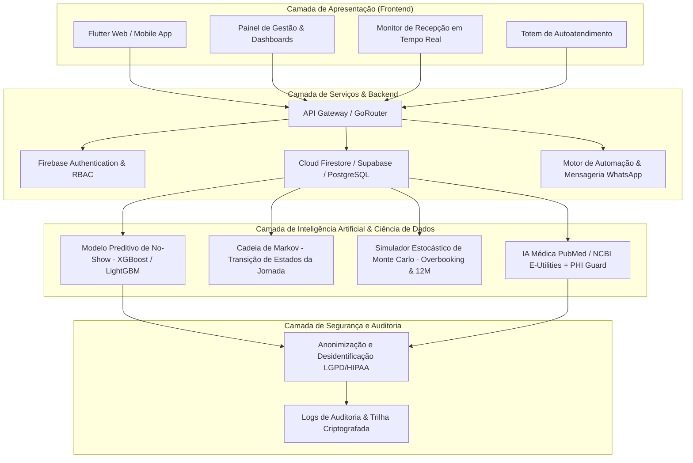

# Arquitetura da Solução — Vitta Care

A plataforma **Vitta Care** foi concebida sob uma arquitetura modular, escalável e segura, voltada à predição de absenteísmo, otimização do fluxo de atendimento e suporte à decisão clínica em serviços de saúde públicos e privados.

---

## 1. Visão Geral da Arquitetura

A arquitetura organiza-se em quatro camadas principais:



---

## 2. Componentes da Solução

### 2.1 Frontend Multiplataforma (Flutter)
- **Framework:** Flutter 3.x (Web e Mobile nativo).
- **Gerenciamento de Estado:** Riverpod com reatividade granular.
- **Roteamento e Deep Linking:** `GoRouter` centralizado, suportando acesso direto a consultas, visualizadores de monitor e rotas públicas/protegidas.
- **Sistema Modular:** Registro de módulos (`ModuleRegistry` e `ModuleGraph`) com validação de dependências em Grafo Acíclico Direcionado (DAG) e ordenação topológica.
- **Interface e Responsividade:** Material Design 3, suporte a múltiplos breakpoints (Mobile, Tablet, Desktop, Totem e Monitor de TV).

### 2.2 Camada de Inteligência Artificial e Modelagem Matemática

| Módulo | Tecnologia / Algoritmo | Objetivo Técnico |
| :--- | :--- | :--- |
| **Predição de Absenteísmo** | XGBoost / Random Forest / Scikit-Learn | Estimativa pontual e intervalar da probabilidade de falta por agendamento. |
| **Jornada Estocástica** | Cadeia de Markov (Laplace Dirichlet Smoothing) | Modelagem da transição probabilística entre os estados da consulta médica. |
| **Otimização de Capacidade** | Simulação de Monte Carlo (Multinomial + 3 incertezas) | Cálculo de overbooking ótimo seguro e projeções operacionais defensáveis. |
| **Medicina Baseada em Evidências**| Integração PubMed / NCBI E-Utilities | Recuperação e síntese de evidências científicas com curadoria clínica. |
| **Proteção de Privacidade** | PHI Guard (Regex + NLP De-identification) | Bloqueio de dados sensíveis antes de qualquer processamento por LLMs ou APIs. |

### 2.3 Backend e Armazenamento
- **Autenticação:** Firebase Auth com suporte a Email/Senha, Google Sign-In, Biometria (WebAuthn / Windows Hello / Touch ID) e RBAC (Administrador, Médico, Recepcionista, Paciente).
- **Banco de Dados:** Cloud Firestore e PostgreSQL/Supabase com índices compostos para consultas em milissegundos.
- **Mensageria:** Integração oficial com APIs de mensageria (WhatsApp Cloud API / Z-API) para disparos com botões de ação e confirmação em 1 clique.

---

## 3. Fluxo de Dados e Inferência Preditiva

```text
[ Agendamento Criado / Atualizado ]
                │
                ▼
[ Coleta de Dados & Higienização ]
                │
                ▼
[ PHI Guard: Anonimização de Dados Sensíveis ]
                │
                ▼
[ Feature Engineering (Antecedência, Histórico, Tempo, Sazonalidade) ]
                │
                ▼
[ Inferência do Modelo Preditivo (Probabilidade & SHAP Values) ]
                │
                ▼
[ Classificação Operacional de Risco (Baixo, Médio, Alto) ]
                │
                ▼
[ Motor de Decisão e Automação: ]
  ├── Envio de Confirmação Rápida WhatsApp
  ├── Oferta de Encaixe / Overbooking Seguro (Monte Carlo)
  └── Alerta no Painel da Recepção & Triagem
```

---

## 4. Segurança, LGPD e Privacidade

1. **Anonimização no Edge:** O módulo PHI Guard remove nomes, CPFs, telefones e identificadores únicos antes do envio para modelos externos.
2. **Minimização de Dados:** A camada de inferência consome apenas atributos numéricos e categóricos desidentificados.
3. **Criptografia:** Tráfego 100% via HTTPS/TLS 1.3 e repouso criptografado (AES-256).
