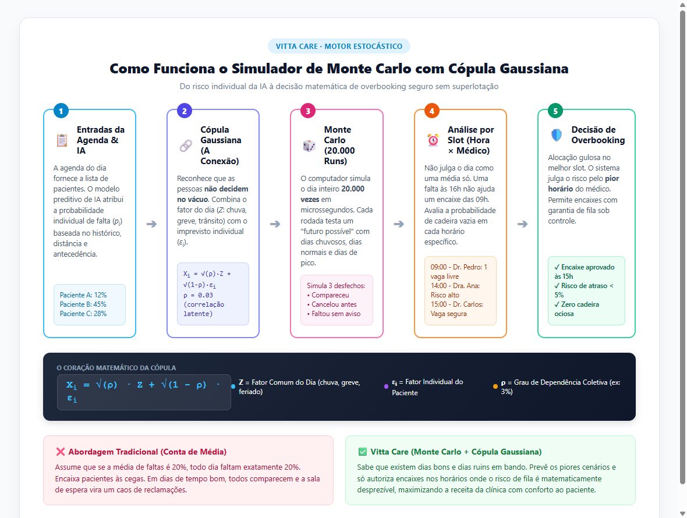

# Entendendo o Simulador de Monte Carlo com Cópula Gaussiana

> **Documento Explicativo Simplificado** — Uma tradução clara e acessível da modelagem estocástica da plataforma Vitta Care para gestores clínicos, profissionais de saúde e avaliadores técnicos.
>
> 📄 **Versão em PDF pronta para impressão e apresentação:** [`docs/Resumo_Monte_Carlo_Copula_Gaussiana.pdf`](Resumo_Monte_Carlo_Copula_Gaussiana.pdf)

---

## 1. A Falácia da "Média": Por que a conta tradicional quebra a clínica?

A maioria dos sistemas de agendamento do mercado opera com uma **conta de padaria ingênua**:
* Se uma clínica atende 100 pacientes por dia e a taxa média histórica de faltas é de **20%**, o gestor conclui: *"Hoje vão faltar 20 pessoas"*.

### Onde está o perigo?
Na prática da saúde, a média quase nunca se repete:
* **Em dias atípicos de comparecimento maciço:** Apenas 4 pacientes faltam. Se a clínica tiver autorizado encaixes com base na "média de 20", a sala de espera superlotará, médicos atrasarão horas e pacientes ficarão insatisfeitos.
* **Em dias de alta desistência:** 35 pacientes faltam. Os médicos ficam de braços cruzados em consultórios ociosos — e a hora clínica perdida **nunca mais pode ser recuperada**.

**Conclusão:** Tratar a incerteza do comportamento humano como um número fixo gera prejuízo financeiro e caos operacional.

---

## 2. O que é a Simulação de Monte Carlo?

O método de **Monte Carlo** é uma técnica computacional inspirada nos jogos de cassino: em vez de tentar adivinhar um único futuro, o computador **"joga os dados" milhares de vezes** para testar todas as possibilidades.

Na Vitta Care, o algoritmo:
1. Pega a probabilidade individual de cada paciente (calculada pela nossa Inteligência Artificial no Azure ML com base em histórico, distância, dia da semana, etc.).
2. Simula o dia de atendimento completo, paciente por paciente.
3. **Repete essa mesma simulação 20.000 vezes** em poucos microssegundos.
4. Gera uma curva com todos os cenários possíveis:
   * *"Em 95% das vezes, faltarão entre 14 e 22 pacientes."*
   * *"A chance de faltarem menos de 8 pessoas hoje é de apenas 1,4%."*

---

## 3. O "Pulo do Gato": Por que precisamos da Cópula Gaussiana?

Uma simulação de Monte Carlo tradicional comete um erro silencioso: ela assume que o paciente $A$ faltar não tem **nenhuma relação** com o paciente $B$ faltar.

Mas no mundo real, **as pessoas vivem na mesma cidade e sofrem as mesmas influências**:
* Se desabar uma chuva torrencial, se houver greve de metrô ou se for sexta-feira que antecede um feriadão, **vários pacientes faltam juntos**.
* Se o dia estiver ensolarado e o trânsito fluir bem, quase todo mundo comparece.

A **Cópula Gaussiana** é a formulação matemática que conecta os pacientes através de uma variável latente compartilhada:

$$X_i = \sqrt{\rho}\, Z + \sqrt{1 - \rho}\, \varepsilon_i$$

| Termo | Significado Didático | Exemplo Real |
|:---|:---|:---|
| **$Z$** | **O Fator do Dia** (comum a todos) | Chuva torrencial, enchente, greve de ônibus, proximidade de feriado. |
| **$\varepsilon_i$** | **O Fator Pessoal** (individual de cada paciente) | Imprevisto particular no trabalho, o carro quebrou, melhora dos sintomas. |
| **$\rho$** | **Correlação Latente** (grau de contágio coletivo) | Calibrado em torno de $0{,}03$ ($3\%$), refletindo o impacto ambiental observado em saúde. |

---

## 4. Fluxograma Visual do Processo

Abaixo está o fluxo completo que transforma a agenda diária em decisões seguras de encaixe:

  

---

## 5. Por que Avaliar por Slot (Hora × Médico) e Nunca por Dia?

Outro erro clássico na gestão hospitalar é permitir um encaixe às **09h da manhã** porque o modelo prevê que haverá uma falta às **16h da tarde**.
* **Uma falta às 16h não libera a cadeira das 09h!**

Por isso, o motor da Vitta Care divide a agenda em **slots de 1 hora por médico**:
* Analisa a probabilidade de ociosidade em cada horário individualmente.
* Utiliza um **algoritmo guloso** que aloca o encaixe no slot de menor risco.
* Julga a segurança da agenda pelo **pior slot do médico** (e não pela média), garantindo que nenhum horário sofra atraso excessivo.

---

## 6. Comparativo: Gestão Tradicional vs Plataforma Vitta Care

| Dimensão | Gestão Convencional (Média) | Plataforma Vitta Care (Estocástica) |
|:---|:---|:---|
| **Previsão de No-Show** | Percentual estático fixo (ex: "20%") | IA preditiva individual + 20.000 cenários de Monte Carlo |
| **Eventos Externos** | Ignorados (assume independência cega) | Cópula Gaussiana de 1 fator (absorve choques de chuva e trânsito) |
| **Granularidade** | Média diária geral da clínica | Slot por slot (médico × hora), julgamento pelo pior horário |
| **Lista de Espera** | Dimensionamento empírico desorganizado | Dimensionada pelo quantil $Q_{25}$ das vagas reais liberadas |
| **Resultado Prático** | Cadeiras vazias ou atrasos caóticos | Recuperação de até 80% da ociosidade mantendo pontualidade |

---

## 7. Arquivos e Recursos Relacionados

* 📄 **PDF Executivo Pronto para Impressão:** [`docs/Resumo_Monte_Carlo_Copula_Gaussiana.pdf`](Resumo_Monte_Carlo_Copula_Gaussiana.pdf)
* 🖼️ **Diagrama do Fluxograma em Alta Resolução:** [`diagrams/fluxograma_monte_carlo.png`](../diagrams/fluxograma_monte_carlo.png)
* 🌐 **Código-Fonte do Fluxograma (HTML/CSS):** [`diagrams/fluxograma_monte_carlo.html`](../diagrams/fluxograma_monte_carlo.html)
* 💻 **Implementação em Dart do Motor:** [`lib/features/monte_carlo/monte_carlo_engine.dart`](https://github.com/allanfs1/Vitta_Care_flutter/blob/main/lib/features/monte_carlo/monte_carlo_engine.dart)
