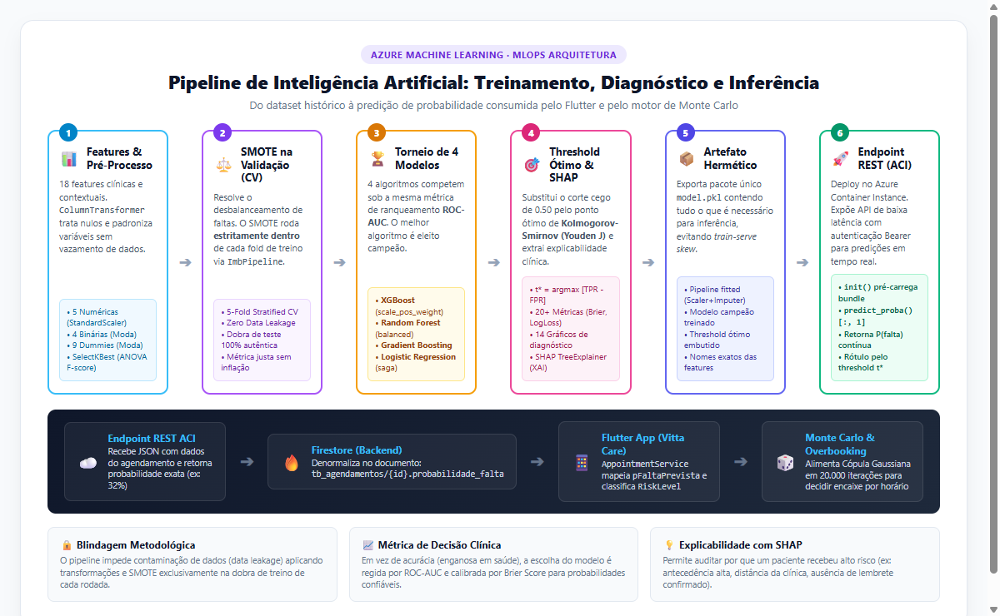

# Pipeline de Inteligência Artificial: Treinamento e Inferência no Azure ML

> **Resumo Executivo e Didático** — Como funciona a inteligência artificial preditiva da plataforma Vitta Care, desde o pré-processamento no Azure ML até o consumo em tempo real no aplicativo Flutter e no motor de Monte Carlo.
>
> 📄 **Versão em PDF pronta para impressão e apresentação (2 páginas):** [`docs/Resumo_Pipeline_IA_Azure_ML.pdf`](Resumo_Pipeline_IA_Azure_ML.pdf)

---

## 1. Fluxograma Geral do Pipeline

O diagrama abaixo ilustra o ciclo de vida completo do modelo: engenharia de atributos, blindagem contra vazamento de dados, torneio de algoritmos, otimização de limiar, deploy como microsserviço e consumo no frontend:

<div align="center">
  
</div>

---

## 2. As 6 Etapas do Pipeline Explicadas de Forma Simples

### Passo 1: Ingestão de Dados & Pré-Processamento Hermético
* **18 Variáveis:** 5 contínuas (antecedência da consulta, distância até a clínica, renda média do bairro, histórico recente de consultas e taxa prévia de comparecimento), 4 binárias (lembrete enviado, proximidade de feriado, fim de semana, histórico de lembretes) e 9 variáveis dummy categóricas (faixas de distância, renda e período manhã/tarde).
* **`ColumnTransformer`:** Aplica imputação por mediana e padronização (`StandardScaler`) nas numéricas, e imputação por moda nas categóricas.
* **Garantia:** Todos os parâmetros ajustados no treino ($\mu, \sigma$) são congelados dentro do pipeline para serem reutilizados na inferência, eliminando divergências (*train-serve skew*).

### Passo 2: Balanceamento com SMOTE sem Vazamento de Dados (*Zero Data Leakage*)
* Em serviços de saúde, a grande maioria dos pacientes comparece (80% a 85%).
* Para equilibrar as classes sem criar viés, o pipeline aplica **SMOTE** (*Synthetic Minority Over-sampling Technique*).
* **A Blindagem:** O SMOTE é encapsulado em um `imblearn.pipeline.Pipeline` e executado **estritamente dentro da dobra de treino** da validação cruzada (5-fold). O conjunto de teste nunca recebe dados sintéticos, garantindo métricas 100% honestas.

### Passo 3: Torneio de 4 Famílias de Algoritmos
Quatro algoritmos competem sob o mesmo protocolo estratificado:
1. **XGBoost Classifier:** Com `scale_pos_weight = N_neg / N_pos`, penalizando o erro nas faltas durante o cálculo dos gradientes de perda.
2. **Random Forest:** Com `class_weight='balanced'`, balanceando os nós de decisão das árvores.
3. **Gradient Boosting:** Boosting sequencial de resíduos com taxa de aprendizado controlada.
4. **Regressão Logística:** Modelo linear robusto com solver `saga` e penalização mista.

* **Métrica de Vitória:** **ROC-AUC** (Área sob a curva ROC). A acurácia tradicional é rejeitada porque um modelo ingênuo que apostasse apenas no comparecimento já teria 85% de acurácia, mas seria inútil na prática médica.

### Passo 4: Limiar Ótimo (Kolmogorov-Smirnov) & Explicabilidade (SHAP)
* **Threshold Ótimo ($t^*$):** Em vez do corte ingênuo de 0.50, o algoritmo encontra o ponto que maximiza a separação entre faltas e presenças (Índice de Youden $J$):
  $$t^* = \arg\max_{t} \left[ \text{TPR}(t) - \text{FPR}(t) \right]$$
* **Explicabilidade Clínica (SHAP):** O `TreeExplainer` traduz a predição para o corpo médico, informando exatamente quanto cada fator somou ou subtraiu na probabilidade daquele paciente específico ($\hat{f}(x) = \phi_0 + \sum \phi_j(x)$).

### Passo 5: Artefato Hermético (`model.pkl`)
O pipeline exporta um arquivo serializado único contendo:
* O pipeline de engenharia de atributos já ajustado.
* O modelo campeão treinado.
* O limiar ótimo $t^*$ calculado.
* A lista exata e ordenada de features esperadas.

### Passo 6: Deploy no Azure Container Instance (ACI)
* Publicado como endpoint REST protegido por token Bearer.
* O script de inferência (`init` e `run`) carrega o bundle na memória e expõe a função `predict_proba()[:, 1]`.
* Retorna tanto a probabilidade contínua quanto o rótulo binário calibrado.

---

## 3. Como o Flutter e o Motor de Monte Carlo Consomem a IA

```text
               Azure ML ACI                     Firestore
             ┌──────────────┐                ┌──────────────┐
             │predict_proba │ ─────────────▶ │tb_agendamento│
             │ (ex: 0.32)   │                │.probabilidade│
             └──────────────┘                │    _falta    │
                                             └──────┬───────┘
                                                    │
                                                    ▼
   Decisão de Overbooking                Flutter (Vitta Care)
   ┌────────────────────┐                ┌──────────────────┐
   │Alocação gulosa     │ ◀───────────── │AppointmentService│
   │Risco pelo pior slot│  Cópula        │.pFaltaPrevista   │
   └────────────────────┘  Gaussiana     └──────────────────┘
```

1. **Ingestão Reativa:** O `AppointmentService` no Flutter lê a probabilidade do documento e atribui ao modelo `Appointment.pFaltaPrevista`.
2. **Cópula Gaussiana:** Na simulação de Monte Carlo de 20.000 iterações, essa probabilidade marginal atua como limiar latente:
   $$X_i = \sqrt{\rho}\, Z + \sqrt{1 - \rho}\, \varepsilon_i$$
3. **Decisão por Slot:** O sistema avalia a agenda em blocos de 1 hora por médico e autoriza encaixes inteligentes onde o risco de fila e atraso na sala de espera é estatisticamente desprezível (< 5%).

---

## 4. Recursos Relacionados no Repositório

* 📄 **PDF Executivo Pronto para Impressão:** [`docs/Resumo_Pipeline_IA_Azure_ML.pdf`](Resumo_Pipeline_IA_Azure_ML.pdf)
* 🖼️ **Diagrama do Fluxograma em Alta Resolução:** [`diagrams/fluxograma_pipeline_ia.png`](../diagrams/fluxograma_pipeline_ia.png)
* 🌐 **Código-Fonte do Fluxograma (HTML/CSS):** [`diagrams/fluxograma_pipeline_ia.html`](../diagrams/fluxograma_pipeline_ia.html)
* 📘 **Especificação Técnica Completa (20+ Métricas & Código Python):** [`docs/pipeline-ia-completo.md`](pipeline-ia-completo.md)
