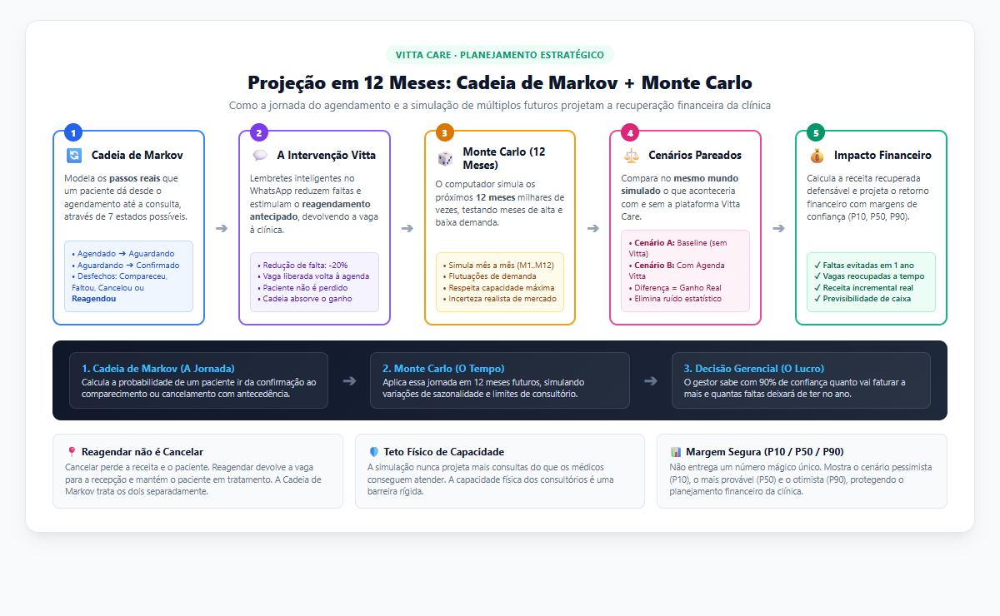

# Projeção em 12 Meses: Cadeia de Markov + Monte Carlo

> **Resumo Didático e Gerencial** — Como a plataforma Vitta Care combina o modelo de transição de estados do paciente com a simulação estocástica para projetar faturamento, ocupação médica e redução de faltas em 1 ano.
>
> 📄 **Versão em PDF pronta para impressão e apresentação (2 páginas):** [`docs/Resumo_Projecao_12_Meses_Markov_Monte_Carlo.pdf`](Resumo_Projecao_12_Meses_Markov_Monte_Carlo.pdf)

---

## 1. Fluxograma Geral da Projeção

O diagrama abaixo ilustra como a jornada do agendamento se desdobra em 12 meses futuros através de simulações em espelho (Cenários Pareados):

  

---

## 2. Os Dois Motores Explicados de Forma Simples

### Peça 1: Cadeia de Markov (A Psicologia e os Passos do Paciente)
A Cadeia de Markov modela os **passos reais** que um paciente dá ao longo do tempo:
1. **Passos Iniciais (Transitórios):**
   * O paciente agenda a consulta (`Agendado`).
   * Passa para `Aguardando confirmação`.
   * Quando responde ao WhatsApp da clínica, torna-se `Confirmado`.
2. **Passos Finais (Absorventes):**
   * No dia agendado, ele pode: **Comparecer**, **Faltar sem avisar**, **Cancelar** ou **Reagendar**.

> 💡 **O Segredo Clínico:** *Reagendar NÃO é cancelar!*  
> Cancelar perde o paciente e destrói o horário. Reagendar devolve a vaga de hoje para alguém da fila e mantém o paciente no tratamento. A automação da Vitta Care atua exatamente para transformar desistências em reagendamentos antecipados.

---

### Peça 2: Simulação de Monte Carlo (A Incerteza do Tempo e do Mercado)
A Cadeia de Markov dá a taxa de probabilidade da jornada. O **Monte Carlo** aplica essa dinâmica mês a mês durante **1 ano inteiro**, simulando milhares de "futuros possíveis":
* **Variação de Demanda:** Simula meses de pico de agendamentos e meses mais fracos (sazonalidade).
* **Teto Rígido de Capacidade:** A simulação nunca inventa atendimentos milagrosos: o limite de horas de consultório dos médicos é uma barreira intransponível.
* **Cenários Pareados no Mesmo Mundo:** Para saber com precisão o que a Vitta Care traz de ganho, o computador roda os mesmos choques de mercado em dois cenários em paralelo:
  * **Cenário A (Baseline):** A clínica operando do jeito antigo.
  * **Cenário B (Com Vitta Care):** A clínica operando com lembretes inteligentes, overbooking seguro e gestão de fila.
  * **Diferença (B - A):** O ganho financeiro e assistencial líquido real.

---

## 3. O que a Diretoria da Clínica Descobre no Relatório?

Em vez de uma estimativa estática ou mágica, o gestor recebe intervalos de confiança calibrados:
* **P10 (Pessimista):** Em 90% dos anos simulados, o ganho da clínica será **maior** do que este valor.
* **P50 (Mais Provável):** O cenário mediano esperado para o faturamento e para as faltas evitadas.
* **P90 (Otimista):** O potencial de ganho em anos com excelente engajamento dos pacientes.

| Indicador Anual | Cenário Antigo (Baseline) | Com Vitta Care | Impacto Líquido |
|:---|:---|:---|:---|
| **Faltas Totais no Ano** | ~2.400 faltas | ~1.680 faltas | **720 faltas evitadas** (-30%) |
| **Vagas Reocupadas a Tempo** | Quase zero | Fila dimensionada por $Q_{25}$ | **480 novas consultas** aproveitadas |
| **Taxa de Ocupação Médica** | 74% da grade | 88% da grade | **+14 pontos percentuais** |
| **Previsibilidade de Caixa** | Incerteza mês a mês | Metas com margem de segurança | Segurança para contratar e investir |

---

## 4. Recursos Relacionados no Repositório

* 📄 **PDF Executivo Pronto para Impressão:** [`docs/Resumo_Projecao_12_Meses_Markov_Monte_Carlo.pdf`](Resumo_Projecao_12_Meses_Markov_Monte_Carlo.pdf)
* 🖼️ **Diagrama do Fluxograma em Alta Resolução:** [`diagrams/fluxograma_projecao_12m.png`](../diagrams/fluxograma_projecao_12m.png)
* 🌐 **Código-Fonte do Fluxograma (HTML/CSS):** [`diagrams/fluxograma_projecao_12m.html`](../diagrams/fluxograma_projecao_12m.html)
* 💻 **Código em Dart do Motor Markov:** [`lib/features/projecao_12m/markov_engine.dart`](https://github.com/allanfs1/Vitta_Care_flutter/blob/main/lib/features/projecao_12m/markov_engine.dart)
* 💻 **Código em Dart do Motor de Projeção:** [`lib/features/projecao_12m/projecao_engine.dart`](https://github.com/allanfs1/Vitta_Care_flutter/blob/main/lib/features/projecao_12m/projecao_engine.dart)
