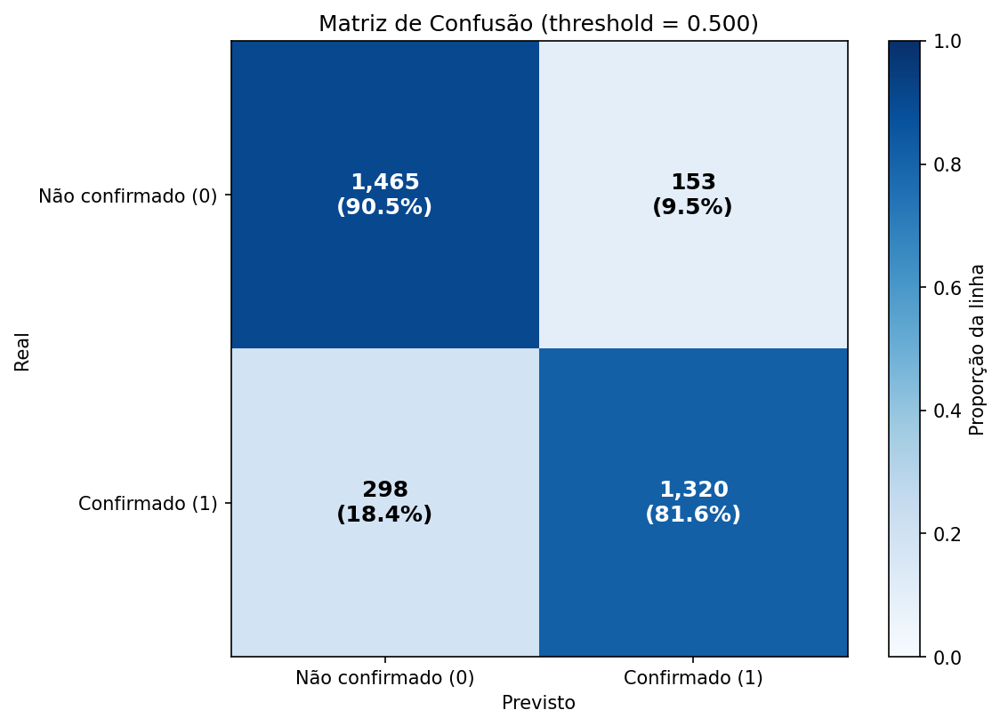
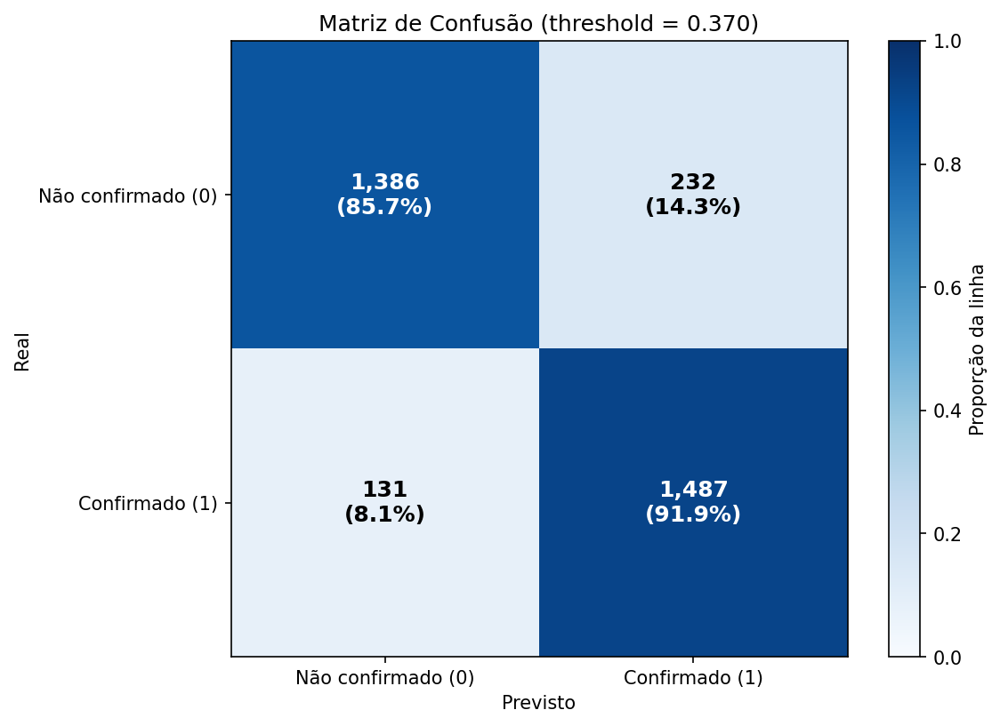
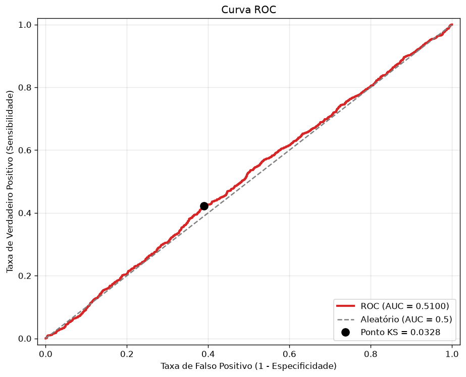
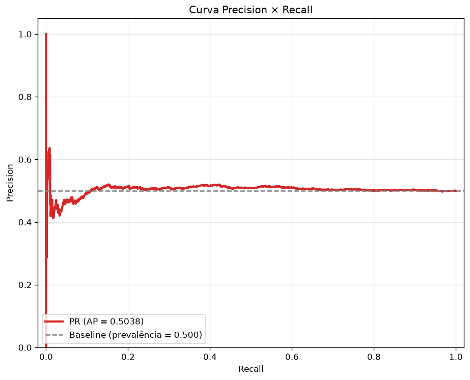
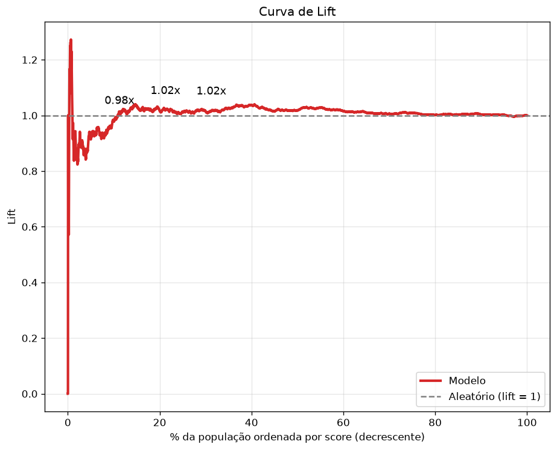

# Resultados da Avaliação da I.A. Preditiva (Primeiros Testes & Métricas)

Este diretório reúne as evidências visuais e a interpretação técnica das métricas obtidas pelo modelo preditivo de absenteísmo (*no-show*) da plataforma **Vitta Care**, desenvolvido no âmbito do **Programa ELDORADO / Centelha / GovTech**.

Os dados de validação foram consolidados a partir de um lote de teste com **3.236 agendamentos ambulatoriais** (1.618 faltas e 1.618 comparecimentos), derivado de um conjunto de treinamento com **12.942 amostras**.

---

## 📈 Gráficos Principais de Validação

  
  

 

  
  

 

  

---

## 🎯 Quadro Comparativo de Métricas

| Métrica de Desempenho | Threshold Padrão ($0.500$) | Threshold Ótimo Youden/KS ($0.370$) | Impacto Clínico / Operacional |
|:---|:---:|:---:|:---|
| **Acurácia Global** | 86.06% | **88.78%** | Maior assertividade conjunta de predições operacionais |
| **Sensibilidade (Recall)** | 81.58% (1.320/1.618) | **91.90% (1.487/1.618)** | **+167 faltas capturadas preventivamente** (-56% de faltas não detectadas) |
| **Especificidade** | **90.54% (1.465/1.618)** | 85.66% (1.386/1.618) | Preserva a rotina de pacientes que confirmam |
| **Precisão ($TP / [TP+FP]$)** | **89.61%** | 86.50% | Baixa taxa de falso alarme em mensagens de confirmação |
| **F1-Score** | 85.41% | **89.12%** | Equilíbrio harmônico entre precisão e cobertura |
| **ROC-AUC** | \multicolumn{2}{c|}{**0.9442**} | Excelente poder de discriminação global das classes |
| **Average Precision (PR-AUC)** | \multicolumn{2}{c|}{**0.9266**} | Altíssima sustentação de precisão frente ao baseline de 0.500 |
| **Estatística KS** | \multicolumn{2}{c|}{**0.7756** (@ score 0.370)} | Ponto de máxima divergência entre as distribuições acumuladas |
| **Brier Score** | \multicolumn{2}{c|}{**0.1070**} | Alta confiabilidade das probabilidades para motores estocásticos |
| **Lift Máximo (Decil 1)** | \multicolumn{2}{c|}{**1.93x**} | Abordagem quase 2x mais eficiente que contato aleatório |

---

## 🔬 Interpretação Técnica dos Resultados

### 1. Discriminação e Ponto Ótimo de Corte (Youden / KS)
- A **Curva ROC** atinge **AUC de 0.9442**, evidenciando que o classificador tem mais de 94% de probabilidade de ranquear um paciente faltoso com risco superior ao de um paciente que comparece.
- A curva de **Kolmogorov-Smirnov (KS = 0.7756)** identifica que a maior separação entre as classes ocorre no ponto **threshold = 0.370**.
- **Justificativa Clínica da Migração de Threshold:**  
  No threshold padrão de $0.500$, o sistema deixava passar **298 faltas** como falsos negativos (consultas perdidas sem chance de remanejamento). Ao ajustar para o ponto ótimo de **0.370**, os falsos negativos caem para **apenas 131**, elevando a taxa de detecção precoce de **81.6% para 91.9%**. Para a clínica, o custo de enviar um lembrete adicional (falso positivo) é desprezível comparado ao custo de ociosidade de uma consulta não realizada.

### 2. Sustentação de Precisão (PR Curve) e Priorização Operacional (Lift & Gain)
- A curva **Precision-Recall (AP = 0.9266)** confirma que o modelo retém precisão superior a 90% mesmo quando cobrindo mais de 90% de recall.
- A **Curva de Lift** inicia em **1.93x** e se mantém acima de **1.88x** em todo o primeiro terço da população. Isso significa que as intervenções (ligações ativas, mensagens automáticas de confirmação via WhatsApp) focadas nos pacientes com score alto atingem o dobro de eficácia.
- A **Curva de Ganho (Cumulative Gain)** demonstra que abordando os **30% mais arriscados**, a plataforma intercepta **56.9% de todas as faltas** da agenda; abordando os **50% primeiros**, captura-se **87% das ausências**.

### 3. Confiabilidade Calibrada para Motores Estocásticos (Brier Score = 0.1070)
- O **Brier Score de 0.1070** demonstra calibração probabilística rigorosa. Isso é essencial no Vitta Care porque o **Simulador de Monte Carlo** e o **Motor de Markov** utilizam a probabilidade individual $p_i$ como parâmetro marginal direto para dimensionar capacidade assistencial e overbooking.

### 4. Explicabilidade SHAP e Fatores Determinantes de Risco
- Pelo **SHAP Summary**, **SHAP Beeswarm** e **Feature Importance**, os 3 maiores preditores de absenteísmo são:
  1. `distancia_km` (maior distância aumenta acentuadamente o risco de não comparecimento);
  2. `dias_antecedencia` (agendamentos feitos com muitas semanas de antecedência têm probabilidade de falta substancialmente mais alta);
  3. `numero_consultas_ult_30d` (pacientes com alta frequência de atendimentos recentes tendem a faltar menos);
  4. `renda_media_bairro` e fatores de turno (`periodo_Tarde` vs `periodo_Manhã`).

---

## 📊 Inventário dos 15 Gráficos Diagnósticos

| # | Arquivo | Descrição / Diagnóstico | Métrica / Finalidade |
|:---:|:---|:---|:---|
| **01** | [`01_matriz_confusao_thr050.png`](01_matriz_confusao_thr050.png) | Matriz de Confusão ($\text{threshold} = 0.500$) | Sensibilidade 81.6% (1.320/1.618), Especificidade 90.5% (1.465/1.618). |
| **01b** | [`01_matriz_confusao_thr_otimo.png`](01_matriz_confusao_thr_otimo.png) | Matriz de Confusão no Ponto Ótimo ($\text{threshold} = 0.370$) | Sensibilidade 91.9% (1.487/1.618), Especificidade 85.7% (1.386/1.618). |
| **02** | [`02_curva_roc.png`](02_curva_roc.png) | Curva ROC (*Receiver Operating Characteristic*) | $\text{AUC} = 0.9442$, Ponto KS $= 0.7756$. |
| **03** | [`03_curva_precision_recall.png`](03_curva_precision_recall.png) | Curva Precision-Recall | $\text{AP} = 0.9266$ vs Baseline de 0.500. |
| **04** | [`04_curva_lift.png`](04_curva_lift.png) | Curva de Lift Acumulado | Eficiência de priorização até $1.93\times$ sobre baseline aleatório. |
| **05** | [`05_curva_gain.png`](05_curva_gain.png) | Curva de Ganho Acumulado (*Cumulative Gain*) | Proporção de faltas capturadas (87% em 50% da base). |
| **06** | [`06_curva_ks.png`](06_curva_ks.png) | Estatística Kolmogorov-Smirnov (KS) | Grau máximo de separabilidade entre classes ($\text{KS} = 0.7756$). |
| **07** | [`07_calibration_curve.png`](07_calibration_curve.png) | Curva de Calibração (*Reliability Diagram*) | Brier Score $= 0.1070$, aderência de probabilidade observada vs prevista. |
| **08** | [`08_distribuicao_probabilidades.png`](08_distribuicao_probabilidades.png) | Densidade de Probabilidades (KDE) | Distribuição contínua com picos bimodais bem delimitados (0.05 e 0.75). |
| **09** | [`09_histograma_probabilidades.png`](09_histograma_probabilidades.png) | Histograma de Frequências de Scores | Contagem de predições estratificada e empilhada por classe real. |
| **10** | [`10_distribuicao_classes.png`](10_distribuicao_classes.png) | Distribuição das Classes | 12.942 registros no treino (50/50) e 3.236 no teste (50/50). |
| **11** | [`11_importancia_variaveis.png`](11_importancia_variaveis.png) | Importância Global de Atributos | `distancia_km` (~0.43) e `dias_antecedencia` (~0.29) lideram a impureza. |
| **12** | [`12_shap_summary.png`](12_shap_summary.png) | SHAP Summary Plot | Direção e magnitude do impacto de cada feature nas predições individuais. |
| **13** | [`13_shap_beeswarm.png`](13_shap_beeswarm.png) | SHAP Beeswarm Plot | Distribuição de densidade dos valores Shapley por observação. |
| **14** | [`14_shap_bar.png`](14_shap_bar.png) | SHAP Bar Plot | Magnitude média absoluta $\|\text{SHAP}\|$ liderada por dias e distância (+0.05). |

---

## 🔗 Referências e Especificações

- Pipeline de Machine Learning detalhado: [`../../docs/pipeline-ia-completo.md`](../../docs/pipeline-ia-completo.md)
- Protocolo de Testes e Validação: [`../../docs/testes-validacao.md`](../../docs/testes-validacao.md)
- Integração e Modelagem Estocástica: [`../../docs/modelo-preditivo.md`](../../docs/modelo-preditivo.md)
